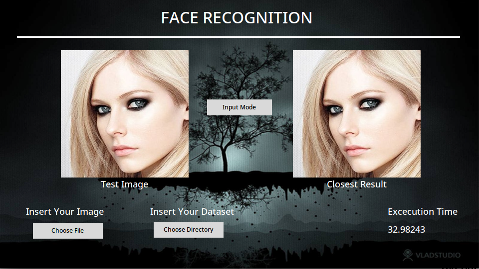
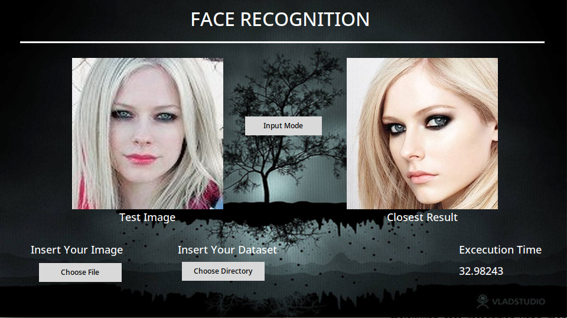
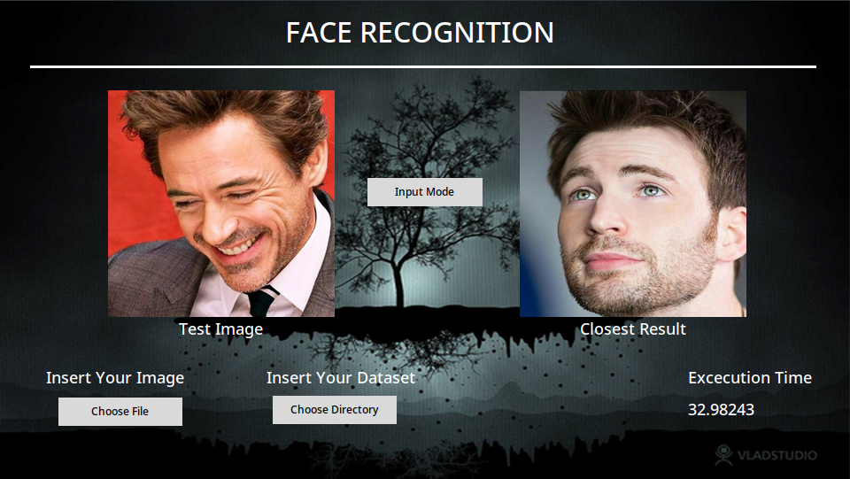
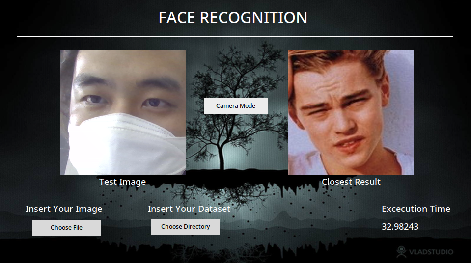

# Face Recognition with EigenFace method
> Tugas Besar 2 IF 2123 Aljabar Linier dan Geometri
> 
> Aplikasi Nilai **Eigen** dan **EigenFace** pada Pengenalan Wajah (Face Recognition)
> 
> Oleh Kelompok 40 - DigOldBicks
> 
> [Video Aplikasi](https://www.youtube.com/watch?v=dQw4w9WgXcQ) <!-- jangan lupa ganti ke video tubes -->

## Daftar isi
* [Tentang Proyek](#tentang-proyek)
* [Fitur](#fitur)
* [Screenshots](#screenshots)
* [Requirement](#requirement)
* [Setup](#setup)
* [Usage](#usage)
* [Status Proyek](#status-proyek)
* [Room for Improvement](#room-for-improvement)
* [Acknowledgements](#acknowledgements)


## Tentang Proyek
- Teknologi *face recognition* sederhana menggunakan nilai eigen dan EigenFace
- Penggunaan EigenFace memungkinkan pencocokan wajah tanpa membutuhkan fitur-fitur wajah, serta relatif mudah diimplementasikan
- Penggunaan program face recognition dengan EigenFace membutuhkan pencahayaan yang baik dan posisi wajah yang tepat di tengah gambar


## Fitur
Program dapat menjalankan fitur-fitur:
- Face recognition sebuah file gambar
- Face recognition melalui kamera
**Perlu diperhatikan bahwa dataset pengenalan wajah perlu disediakan sendiri**


## Screenshots









## Requirement
- Python    3.11.0
- Numpy     1.23.4
- OpenCv    4.6.0.66
- Tcl/Tk    8.6


## Setup
Pastikan telah ter-instal python dan library-library yang diperlukan pada [Requirement](#requirement) untuk instalasi Python dapat diikuti langkah-langkah ini: [Instalasi Python](https://www.python.org/about/gettingstarted/)


## Usage
### Starting
Pada directory src, jalankan ```py main.py``` pada console (atau, pada main.py anda dapat memilih pilihan **Open With** -> **Python**).

Setelah program berjalan, klik "Choose Directory", kemudian pilih folder yang berisi gambar-gambar training.

Setelah tahap pre-processing selesai, anda dapat meng-klik tombol "Input Mode" atau "Camera Mode" - tulisan yang ditamppilkan tergantung mode saat ini. Meng-klik tombol tersebut akan mengganti mode program ke mode sebaliknya.

### Input Mode
Pilih gambar yang akan anda cocokkan dengan wajah dari dataset, output gambar yang paling mendekati dari dataset akan ditampilkan pada bingkai sebelah kanan.

### Camera Mode
Camera mode akan menerima input dari kamera perangkat anda, output gambar yang paling mendekati dari dataset akan ditampilkan pada bingkai sebelah kanan.


## Status Proyek
Proyek telah: _selesai_.

*Tidak ada rencana perubahan, penambahan, maupun optimisasi program dalam jangka waktu dekat.*


## Room for Improvement
Room for improvement:
- Algoritma QR untuk mencari nilai eigen dapat dioptimisasi dengan mengkonversi matriks masukan ke dalam bentuk *upper hessenberg matrix*, yang dapat mengurangi jumlah iterasi untuk mencapai kekonvergenan nilai eigen.


## Acknowledgements
- Tugas ini dipelopori oleh mata kuliah IF2123 Teknik Informatika Institut Teknologi Bandung, yang telah diorganisasikan dengan baik oleh tim pengajar dan asisten-asisten IF2123 - 2022
- Instruksi dan langkah-langkah pengerjaan dapat dilihat pada [Spesifikasi Tubes 2 Algeo 2022](https://docs.google.com/document/d/1-5JH-SmcUdFCGRMl5z_C9s9-SexH68UX/)
- Proyek ini didasari oleh metode face recognition dengan metode EigenFace melalui [ML | Face Recognition Using Eigenfaces (PCA Algorithm)](https://www.geeksforgeeks.org/ml-face-recognition-using-eigenfaces-pca-algorithm/).
- Template README oleh [@flynerdpl](https://www.flynerd.pl/): [README](https://github.com/ritaly/README-cheatsheet)
- Terima kasih kepada sumber-sumber referensi dan metode sebagai dasar yang telah dicantumkan pada bagian-bagian yang bersangkutan dalam source code


